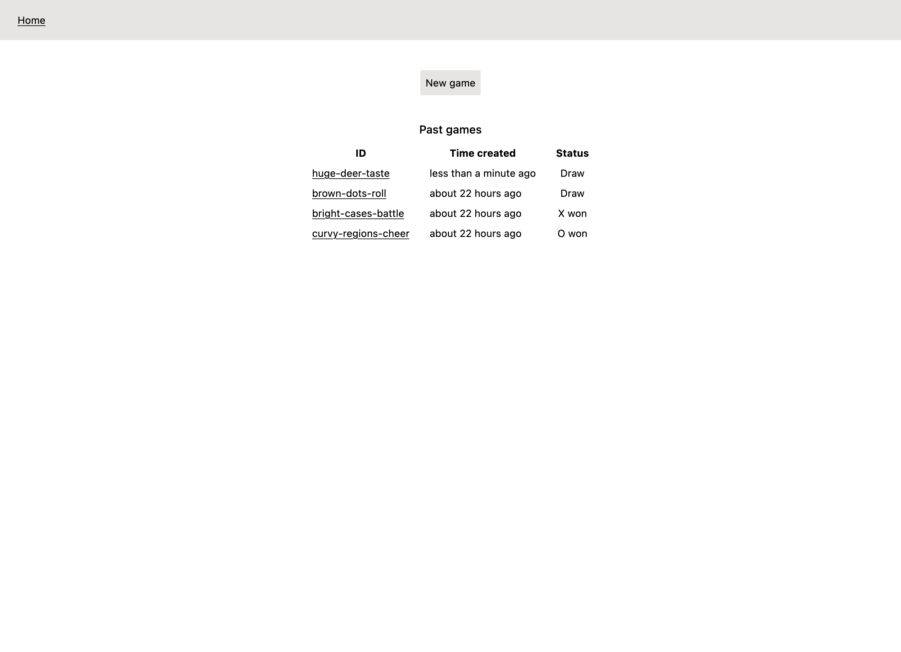
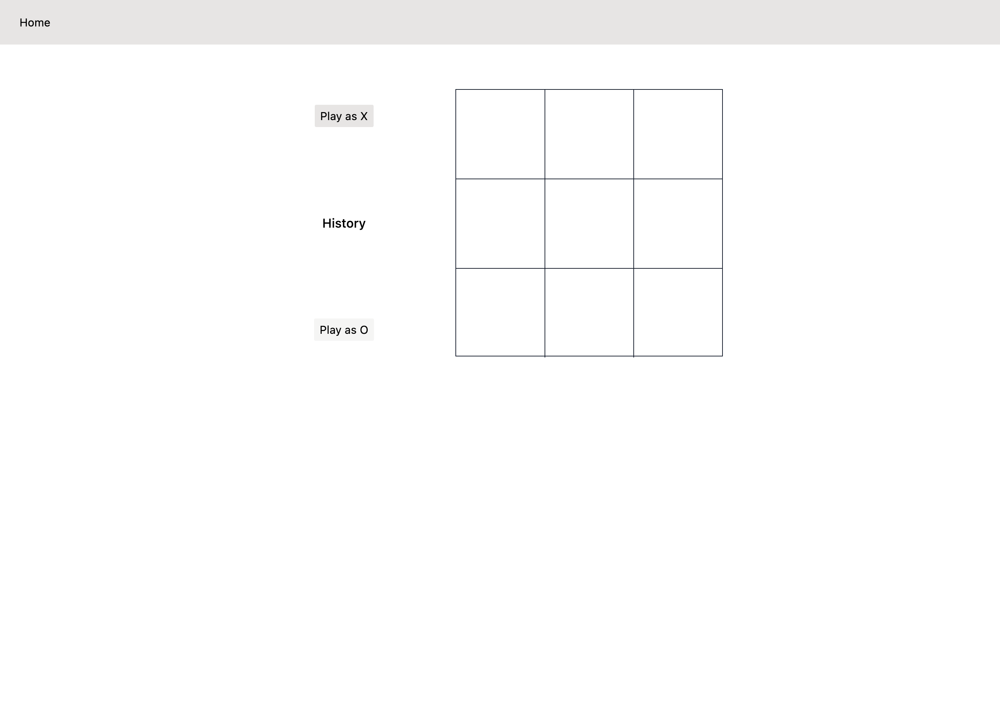
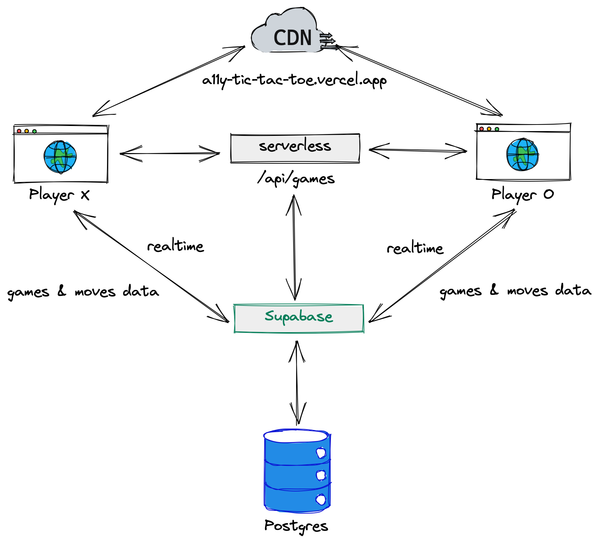

# A11y Tic Tac Toe

This is a prototype Tic Tac Toe game focused on accessibility, or a11y. This game is hosted on [Vercel](https://vercel.com), you can try out the demo [here](https://a11y-tic-tac-toe.vercel.app).

## Table of Contents

- [Getting Started](#getting-started)
  - [Running the Game Locally](#running-the-game-locally)
  - [Creating a Game Session](#creating-a-game-session)
- [Backend APIs](#backend-apis)
  - [`GET /api/games`](#get-apigames)
  - [`POST /api/games`](#post-apigames)
- [Accessibility Considerations](#accessibility-considerations)
- [Architecture](#architecture)

## Getting Started

### Running the Game Locally

First, install the dependencies:

```bash
npm install
# or
yarn
# or
pnpm install
```

Next, run the development server:

```bash
npm run dev
# or
yarn dev
# or
pnpm dev
```

The app will be available at [http://localhost:3000](http://localhost:3000), and the API endpoints will be accessible at [http://localhost:3000/api](http://localhost:3000/api).

### Creating a Game Session

When you first open the app, the home page looks something like this:



Click the "New Game" button to create a new session with a randomly generated ID. You'll be redirected to a new game page that looks like this:



You can choose with player (X or O) to play as by clicking the "Play as X" or "Play as O" button. A second player can join the game by going to the same URL, and play as the other player. The game will start when player X makes the first move.

## Backend APIs

The backend uses Next.js' API routes, which will run as serverless functions when hosted with a provider like [Vercel](https://vercel.com).

The backend has the following API endpoints:

### `GET /api/games`

Returns a list of all game sessions.

Example request:

```bash
$ curl http://localhost:3000/api/games

[
  {
    "id": "angry-bugs-itch",
    "created_at": "2023-02-14T13:30:05.444684+00:00",
    "winner": null
  },
  {
    "id": "huge-deer-taste",
    "created_at": "2023-02-14T13:26:17.742466+00:00",
    "winner": "draw"
  },
  {
    "id": "bright-cases-battle",
    "created_at": "2023-02-13T15:26:21.082317+00:00",
    "winner": "X"
  },
  {
    "id": "curvy-regions-cheer",
    "created_at": "2023-02-13T15:23:42.959787+00:00",
    "winner": "O"
  }
]
```

### `POST /api/games`

Creates a new game session and returns the session ID.

Example request:

```bash
$ curl -X POST http://localhost:3000/api/games

{
  "id":"six-glasses-fry"
}
```

## Accessibility Considerations

To make the game more accessible to screen reader users, styling is done minimally with colour contrast kept high. Appropriate ARIA attributes are used to provide context to screen reader, such as to label each cell on the Tic Tac Toe board, as well as to announce new moves and the game results.

## Architecture

Technologies:

- [Next.js](https://nextjs.org) for the frontend as well as backend API routes
- [Tailwind CSS](https://tailwindcss.com) utility classes for styling instead of component libraries
- [Supabase](https://supabase.com) for database hosting and their realtime library, which is used to keep the game state in sync between players


